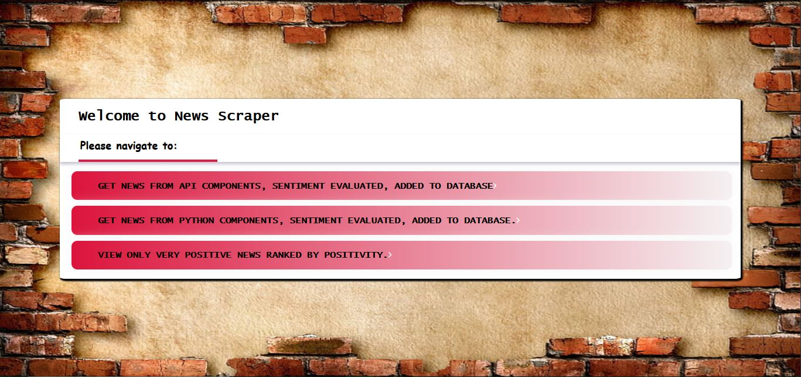
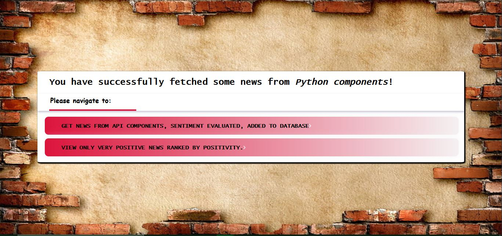
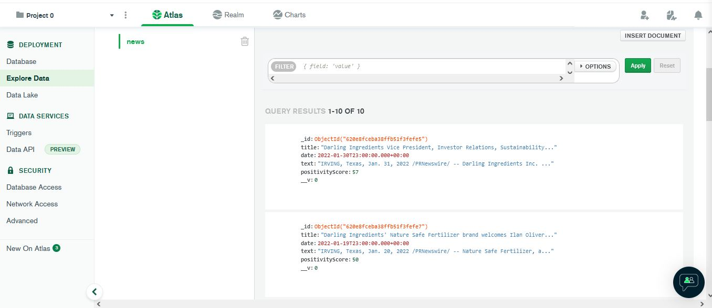
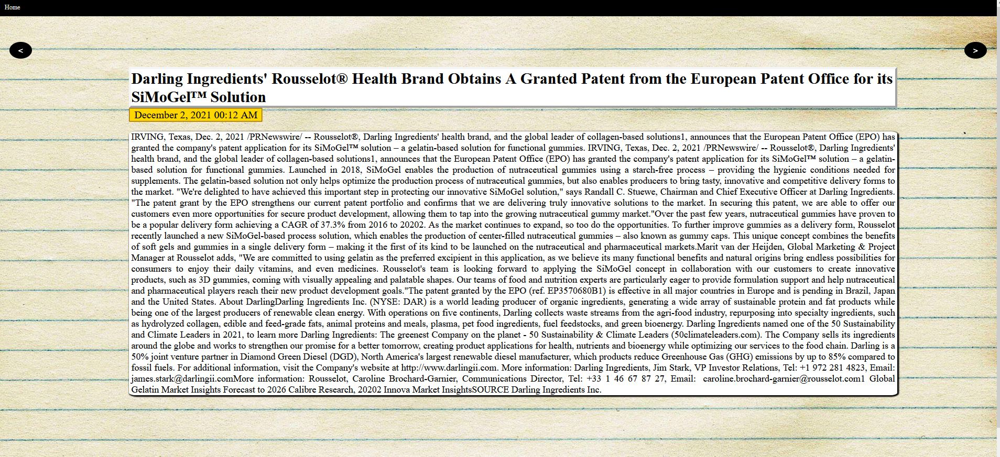

# Web Scraper

newScrape is a framework for fetching and displaying articles from a database.

## Desription

Firstly, fork or copy the Github repo locally. Then run:
``bash
npm install
``
to install all necessary packages. 

Then run the application:
``bash
node index.js
``
#### Please inquire further for database username and password (must add to .env file) and add PORT = <port>.

## About the application

- Home page


- Articles can be fetched through the API components (currently, GNews API):


- Articles can be fetched through the Web Scraper components (currently, from Darling Ingredients own news page):


- Artcles are saved to MongoDB database cluster:


- Articles have the following schema in the database:
```bash
title: String,
date: Date,
text: String,
positivityScore: Number
```

- Articles are evaluated through the npm package sentiment.
    [sentiment package](https://www.npmjs.com/package/sentiment)

- Articles are filtered, so that those with positivityScore > 30 are displayed to the user.
- Articles are ranked in a descending order based on positivityScore
- Articles are displayed in a carousel to the user. They can be navigated through right and left arrow buttons on the sides. It can be navigated to Home page from the navigation bar on top.


- Node.js template engine of choice: Pugjs.

## License
[MIT](https://choosealicense.com/licenses/mit/)